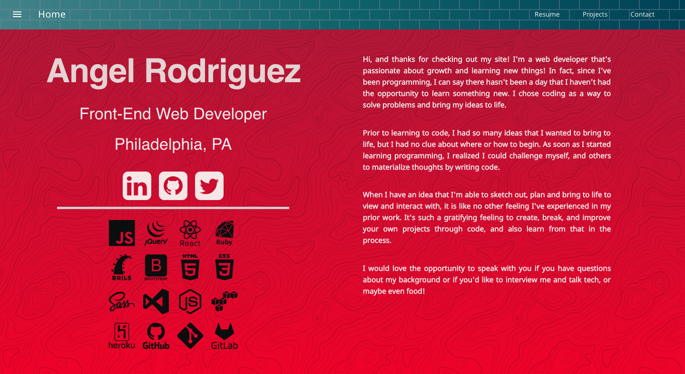
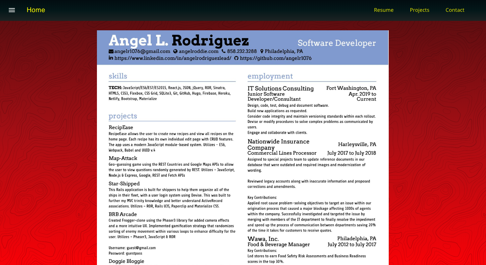
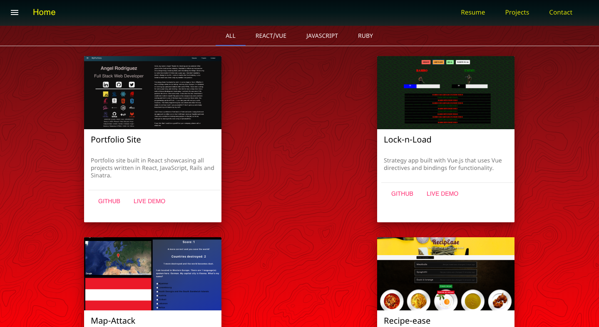
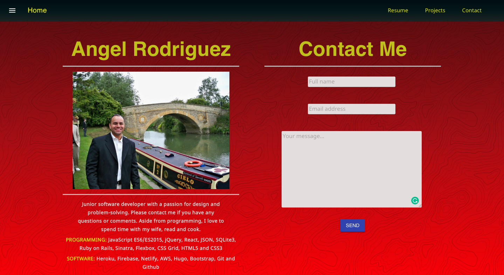

This is a rebuild from a HUGO theme I used as my first portfolio site and rewritten in React. The site is hosted with Firebase and also uses react-mdl. 

If you'd like to run the project locally, please clone it and follow the instructions below:

### `npm start` or `yarn start`
I
Runs the app in development mode. 
Open [http://localhost:3000](http://localhost:3000) to view it in the browser.

The page will automatically reload if you make changes to the code. 
You will see the build errors and lint warnings in the console.

### `npm test` or `yarn test`

Runs the test watcher in an interactive mode. 
By default, runs tests related to files changed since the last commit.

[Read more about testing.](https://facebook.github.io/create-react-app/docs/running-tests)

### `npm run build` or `yarn build`

Builds the app for production to the `build` folder. 
It correctly bundles React in production mode and optimizes the build for the best performance.

The build is minified and the filenames include the hashes. 

Your app is ready to be deployed.

## User Guide

You can find detailed instructions on using Create React App and many tips in [its documentation](https://facebook.github.io/create-react-app/).

